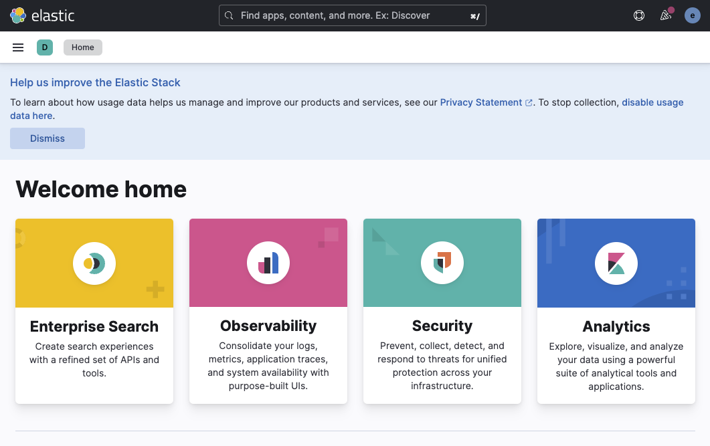

## オペレーターのインストールと動作確認

~~~
k create -f https://download.elastic.co/downloads/eck/2.4.0/crds.yaml
k apply -f https://download.elastic.co/downloads/eck/2.4.0/operator.yaml
k -n elastic-system logs -f statefulset.apps/elastic-operator
~~~

## 名前空間の作成

~~~
k create ns elasticsearch
k config set-context elastic --namespace=elasticsearch --cluster=kubernetes --user=kubernetes-admin
k config use-context elastic
k config get-contexts
~~~

## サービスアカウントとRBACの設定

~~~
k apply -f serviceaccount.yaml
k apply -f cluster-role.yaml
k apply -f cluster-role-binding.yaml
~~~

## オペレーターに対してデプロイを依頼

elasticsearchのバージョンを確認、必要に応じてバージョンを上げる。
情報源は、https://www.elastic.co/guide/en/cloud-on-k8s/current/k8s-deploy-elasticsearch.html

~~~
k apply -f elasticsearch.yaml
~~~

起動の確認

~~~
k get elasticsearch
NAME                HEALTH   NODES   VERSION   PHASE   AGE
elasticsearch-tkr   green    1       8.4.1     Ready   3m21s
~~~

ログから起動状態を確認する

~~~
k get pods --selector='elasticsearch.k8s.elastic.co/cluster-name=elasticsearch-tkr'
NAME                             READY   STATUS    RESTARTS   AGE
elasticsearch-tkr-es-default-0   1/1     Running   0          6m13s
k logs -f elasticsearch-tkr-es-default-0 
~~~

## Elasticsearchへのアクセステスト

~~~
k get svc
NAME                                 TYPE           CLUSTER-IP       EXTERNAL-IP    PORT(S)          AGE
elasticsearch-tkr-es-default         ClusterIP      None             <none>         9200/TCP         51m
elasticsearch-tkr-es-http            ClusterIP      10.100.165.162   <none>         9200/TCP         51m
elasticsearch-tkr-es-internal-http   ClusterIP      10.107.83.250    <none>         9200/TCP         51m
elasticsearch-tkr-es-transport       LoadBalancer   10.105.81.158    192.168.1.84   9300:30353/TCP   51m
~~~

パスワードを取り出し環境変数へセットする

~~~
k get secret elasticsearch-tkr-es-elastic-user -o go-template='{{.data.elastic | base64decode}}'
8wYACa9gI0y9Aoj087mx901L
~~~

ポッド（コンテナ）を実行してcurlでアクセスして確認する。

~~~
k run -it mypod --image=maho/my-ubuntu:0.1 -- bash
root@mypod:/# export PASSWD=8wYACa9gI0y9Aoj087mx901L
root@mypod:/# curl -u "elastic:$PASSWD" -k "https://elasticsearch-tkr-es-http:9200" 
{
  "name" : "elasticsearch-tkr-es-default-0",
  "cluster_name" : "elasticsearch-tkr",
  "cluster_uuid" : "bFdA94NPR7u3r3Z_CgXwsg",
  "version" : {
    "number" : "8.4.1",
    "build_flavor" : "default",
    "build_type" : "docker",
    "build_hash" : "2bd229c8e56650b42e40992322a76e7914258f0c",
    "build_date" : "2022-08-26T12:11:43.232597118Z",
    "build_snapshot" : false,
    "lucene_version" : "9.3.0",
    "minimum_wire_compatibility_version" : "7.17.0",
    "minimum_index_compatibility_version" : "7.0.0"
  },
  "tagline" : "You Know, for Search"
}
~~~

## Kibanaのデプロイ

必要に応じて、kibana.yamlを編集して、バージョンを最新化する。

~~~
k apply -f kibana.yaml 
kibana.kibana.k8s.elastic.co/kibana-tkr created

k get kibana -w
NAME         HEALTH   NODES   VERSION   AGE
kibana-tkr   red              8.4.1     9s
kibana-tkr   green    1       8.4.1     95s
~~~

パスワードを取得

~~~
k get secret elasticsearch-tkr-es-elastic-user -o=jsonpath='{.data.elastic}' | base64 --decode; echo
~~~

ブラウザからのアクセステスト

~~~
https://kibana-tkr-kb-http.elasticsearch.k8s1.labo.local:5601/
~~~

ブラウザで以下の画面が表示を確認する。

## Fluentd のデプロイ

https://docs.fluentd.org/

~~~
k apply -f fluentd-config-map.yaml
~~

コンテナのログが出力されるディレクトリを調べて、fluentd-daemonset-elasticsearch-rbac.yaml の パスを修正

~~~
      volumes:
      - name: varlog
        hostPath:
          path: /var/log
      - name: dockercontainerlogdirectory
        hostPath:
          path: /var/log/pods
~~~

接続先のURL、ポート番号、ユーザーID、パスワードを編集してデプロイ

~~~
k apply -f fluentd-daemonset-elasticsearch-rbac.yaml
~~~

## Kibanaの設定

ハンバーガーメニュー -> Stack Management -> Data -> Index Management の画面で、logstash-* に表示されるのを待つ

次に

Kibana -> Data Views -> [+ Create data view] をクリック

Create data view
Name: fluentd-log
Index pattern: logstash-*
Timeståmp field: @timestamp

[Save data view to Kibana] ボタンをクリック

ハンバーガーメニュー -> Analytics -> Discover

## 以下の参考

~~~
k apply -f fleet-server.yaml
k apply -f elastic-agent.yaml
k get secret elasticsearch-tkr-es-elastic-user -o=jsonpath='{.data.elastic}' | base64 --decode; echo
k port-forward service/kibana-quickstart-kb-http 5601
https://www.elastic.co/guide/en/cloud-on-k8s/current/k8s-quickstart.html
~~~
